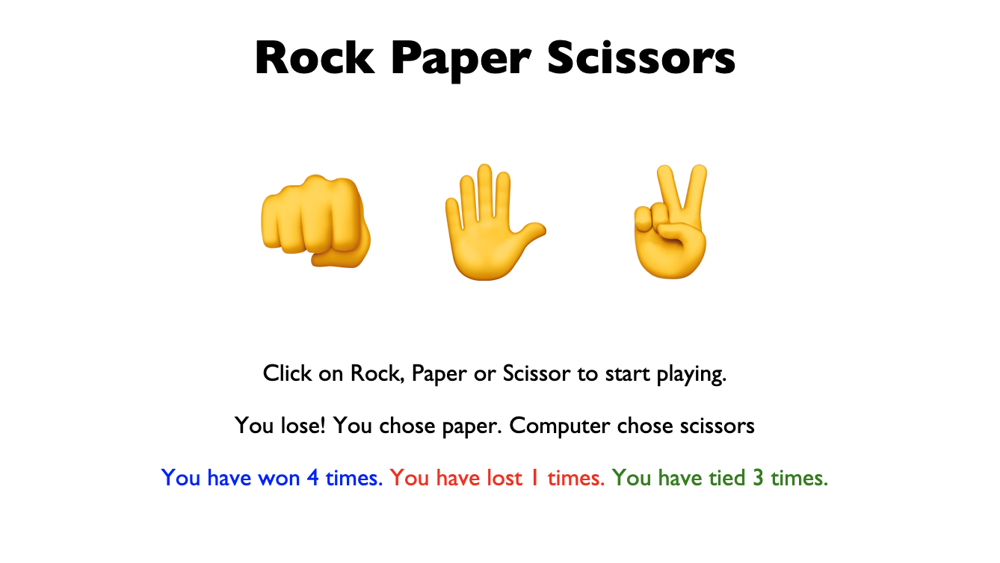

# Password / [Demo](https://yarocruz.github.io/rps) 



## Description

This is the Rock Paper Scissors game. To play the game all you need is to just simple hover and click one of the emojis. The computer immediately selects one, tests the winning, losing, or tie conditions, and displays it on the screen. It's a tiny application, but it's a great exercise to start getting a grip on how to build web applications.

## Technologies

Built with vanilla JavaScript. Key things that are making it all work is first selecting the elements. It adds an event listener to the three emoji icons. And it's using a couple of conditional statements to execute something depending on the three conditions. In this case it's using the .textContent method that's alreay provided by the DOM to fill the paragraph and span elements with the information. Also used a bit of CSS to center everything nicely and add different colors to the spans.

To display the three emojis by the way I copy and pasted them [emojipedia](https://emojipedia.org/search/).

## Problems / Solutions

The meat of the problem with this project was finding a way to grab the value of the emojis and compare them to the value the 'computer' selects. I decided to use the sort of ['hacky' thing of adding a data-value ttribute](https://developer.mozilla.org/en-US/docs/Learn/HTML/Howto/Use_data_attributes) to each of the emoji divs. I learn about this a while back when I went through [Wes Bos' JavaScript 30 videos](https://javascript30.com/).

```
<div class="icons rock" data-value="rock">👊</div>
<div class="icons paper" data-value="paper">✋</div>
<div class="icons scissors" data-value="scissors">✌️</div>
```
Those are later referenced in the the JS code as:

```
let userSelection = item.dataset.value;
```

## Demo

See live demo [here](https://yarocruz.github.io/rps)

## License 

[MIT](/LICENSE)

Feel free to clone this repo and modify as you wish.
